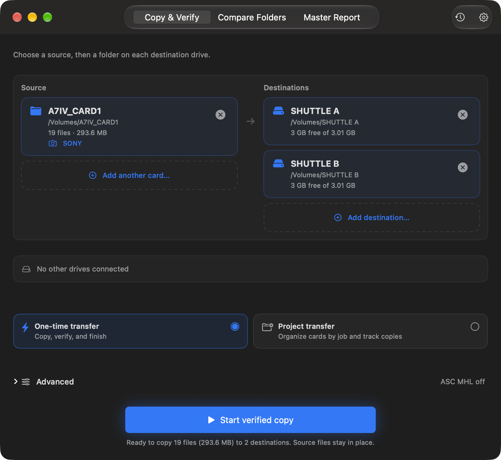
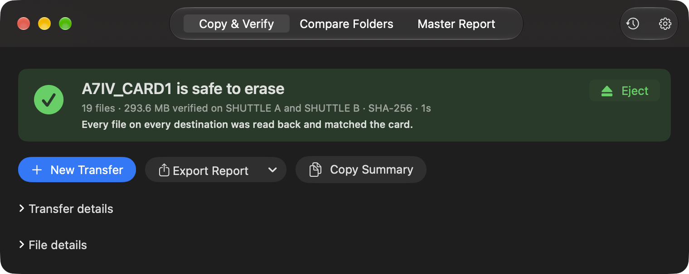
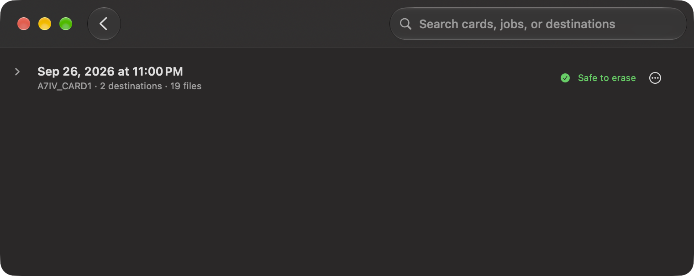

# BitMatch

**A free, open source alternative to ShotPut Pro, Silverstack, and Hedge.**

For indie filmmakers, YouTubers, photographers, and small productions that don't want a subscription just to copy files.

[](https://github.com/mikecerisano/Bitmatch) [](LICENSE) [](https://github.com/mikecerisano/Bitmatch/releases)

[**Download for Mac**](https://github.com/mikecerisano/Bitmatch/releases) · [Release notes](CHANGELOG.md) · [Report a problem](https://github.com/mikecerisano/Bitmatch/issues)



<details><summary>More screenshots</summary>
<p><br></p>
<p><strong>iPad: see what differs between two folders.</strong><br></p>
<p><strong>iPhone: the same per-backup results, on a smaller screen.</strong><br></p>
</details>

*Screenshots use sample data.*

## Download

Signed and notarized macOS build on the [Releases page](https://github.com/mikecerisano/Bitmatch/releases). Supports Apple Silicon and Intel Macs.

Requires **macOS 15.5 or newer**. For iPad and iPhone, build from source for now; they require **iPadOS/iOS 18.5 or newer**.

## How It Works

```text
📷 Camera Card
       │
       ▼
   BitMatch
    │    │
    ▼    ▼
  💾 A   💾 B
```

Plug in your card and drives, allow BitMatch to use them once, and it picks up the card as the source; you choose the destinations. **Standard SHA-256 verification is the default**, reading each destination drive itself; the card is only **Safe to erase** when every file on every destination is verified. Use **One-time transfer** for one card or **Project transfer** for a shoot with several cards and cameras.

## What It Does

- **Multi destination copy** with SHA-256 verification. Each destination gets its own results.
- **Photographer jobs** for shoots with several photographers, cameras, and cards. Save the setup instead of rebuilding it every time.
- **Camera detection** for Sony, Canon, ARRI, RED, Blackmagic, Panasonic, Fujifilm, GoPro, DJI, Insta360, and generic DCIM.
- **Folder compare** for stuff you already copied.
- **PDF, CSV, and JSON reports** for producers who want documentation, or you when you want to check what happened.
- **Transfer queue and history** on Mac, iPad, and iPhone. Interrupted attempts can be reviewed and retried.
- **Optional SFTP backup on Mac** for an off-site copy once the local one is verified.

## Verification Modes

| Mode | What it checks |
| --- | --- |
| Quick | Copy only; no checksum verification |
| Standard — default | SHA-256 |
| Thorough | SHA-256 and MD5 |
| Paranoid | Byte-by-byte comparison plus SHA-256 verification |

Quick means copy only; it does **not** prove the contents match.

## Before You Trust It With Your Footage

**This is beta software from a one-person project.** I have not tested every camera, drive, filesystem, hub, or OS combination. Try it with disposable files first, keep the source card until every destination finishes cleanly, check the report, and keep another independent copy of anything you can't replace.

See the [validation status](docs/HARDWARE_COMPATIBILITY.md) and [hardware testing procedure](docs/HARDWARE_TESTING.md).

More detail (queue and recovery, ASC MHL, photographer jobs, SFTP, cards and drives, building and tests, FAQ): [the guide](docs/GUIDE.md).

## Contributing

PRs welcome. For anything big, start a thread in [Discussions](https://github.com/mikecerisano/Bitmatch/discussions) first so we can talk it through before you sink time into it. BitMatch is supposed to stay simple, and I'd hate for you to build something that doesn't fit.

Build both the Mac and iPad schemes before submitting. Not a coder? Testing on your own cameras, cards, readers, and drives helps just as much. So does telling me what confused you.

## License (MIT, but read this)

- **Please do** fork it, use it, improve it, credit me.
- **Please don't** slap it on the App Store unchanged and charge for it. I can't legally stop you, but it's lazy.

Built over a year of "I'll just add one more feature." MIT License, be a good person. See [LICENSE](LICENSE) for the legal text.
