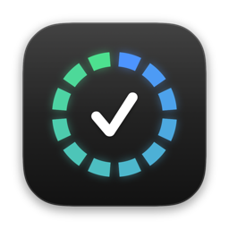
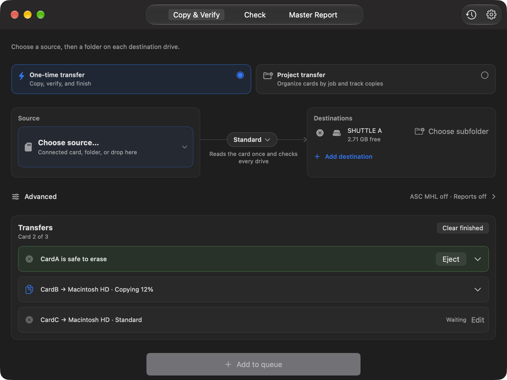

<p align="center">
  
</p>

<h1 align="center">BitMatch</h1>

<p align="center">
  <b>Free, open-source camera card offloading for Mac.</b><br>
  Copy to several drives, verify every file with SHA-256, and know exactly when the card is safe to erase.
</p>

<p align="center">
  <i>A free, open source alternative to ShotPut Pro, Silverstack, and Hedge.</i>
</p>

<p align="center">
  <a href="https://github.com/BitmatchApp/Bitmatch/releases/latest"></a>
  
  
  <a href="LICENSE"></a>
</p>

<p align="center">
  <a href="https://github.com/BitmatchApp/Bitmatch/releases/latest"><b>Download for Mac</b></a> ·
  <a href="https://bitmatchapp.github.io">Website</a> ·
  <a href="CHANGELOG.md">What's new</a> ·
  <a href="docs/GUIDE.md">Guide</a> ·
  <a href="https://github.com/BitmatchApp/Bitmatch/issues">Report a problem</a>
</p>

<p align="center">
  
</p>

For indie filmmakers, YouTubers, photographers, and small productions that don't want a subscription just to copy files.

## Download

Signed and notarized macOS build on the [Releases page](https://github.com/BitmatchApp/Bitmatch/releases/latest), or with [Homebrew](https://brew.sh):

```sh
brew install --cask bitmatchapp/tap/bitmatch
```
 Supports Apple Silicon and Intel Macs.

Requires **macOS 15.5 or newer**. For iPad and iPhone, build from source for now; they require **iPadOS/iOS 18.5 or newer**.

## How It Works

```text
📷 Camera Card
       │
       ▼
   BitMatch
    │    │
    ▼    ▼
  💾 A   💾 B
```

Plug in your card and drives, allow BitMatch to use them once, and it picks up the card as the source; you choose the destinations. BitMatch reads the card **once** and writes every drive at the same time, then reads each drive back from disk to verify it. The card is only **Safe to erase** when every file on every destination is verified. Queue the next card while one copies; each card is a row that shows its own progress and verdict. Use **One-time transfer** for one card or **Project transfer** for a shoot with several cards and cameras.

## What It Does

- **Multi destination copy**: the card is read once and written to every drive at the same time, then each drive is read back and checked with SHA-256. Each destination gets its own results.
- **Careful about "safe to erase"**: a card or folder that changes during the copy, online-only iCloud/Dropbox files, or two "backups" on the same physical drive never count as safe. Hidden `._` files are copied and verified too.
- **Photographer jobs** for shoots with several photographers, cameras, and cards. Save the setup instead of rebuilding it every time.
- **Camera detection** for Sony, Canon, ARRI, RED, Blackmagic, Panasonic, Fujifilm, GoPro, DJI, Insta360, and generic DCIM.
- **Folder compare** for stuff you already copied.
- **PDF, CSV, and JSON reports** for producers who want documentation, or you when you want to check what happened.
- **Transfer queue and history** on Mac, iPad, and iPhone. Interrupted attempts can be reviewed and retried. Copying a card you already backed up tells you so.
- **Updates itself** on Mac: new versions arrive inside the app, signed and checked before they install.
- **Optional SFTP backup on Mac** for an off-site copy once the local one is verified.

## Verification Modes

| Mode | What it checks |
| --- | --- |
| Quick | Copy only; no checksum verification |
| Standard — default | Reads the card once; reads every drive back and checks SHA-256 |
| Thorough | Also re-reads the card; SHA-256 and MD5 |
| Paranoid | Also re-reads the card and compares every byte, plus SHA-256 |

Quick means copy only; it does **not** prove the contents match.

## Before You Trust It With Your Footage

**This is beta software from a one-person project.** I have not tested every camera, drive, filesystem, hub, or OS combination. Try it with disposable files first, keep the source card until every destination finishes cleanly, check the report, and keep another independent copy of anything you can't replace.

See the [validation status](docs/HARDWARE_COMPATIBILITY.md) and [hardware testing procedure](docs/HARDWARE_TESTING.md).

More detail (queue and recovery, ASC MHL, photographer jobs, SFTP, cards and drives, building and tests, FAQ): [the guide](docs/GUIDE.md).

## Contributing

PRs welcome. For anything big, start a thread in [Discussions](https://github.com/BitmatchApp/Bitmatch/discussions) first so we can talk it through before you sink time into it. BitMatch is supposed to stay simple, and I'd hate for you to build something that doesn't fit.

Build both the Mac and iPad schemes before submitting. Not a coder? Testing on your own cameras, cards, readers, and drives helps just as much. So does telling me what confused you.

## License (MIT, but read this)

- **Please do** fork it, use it, improve it, credit me.
- **Please don't** slap it on the App Store unchanged and charge for it. I can't legally stop you, but it's lazy.

Built over a year of "I'll just add one more feature." MIT License, be a good person. See [LICENSE](LICENSE) for the legal text.
